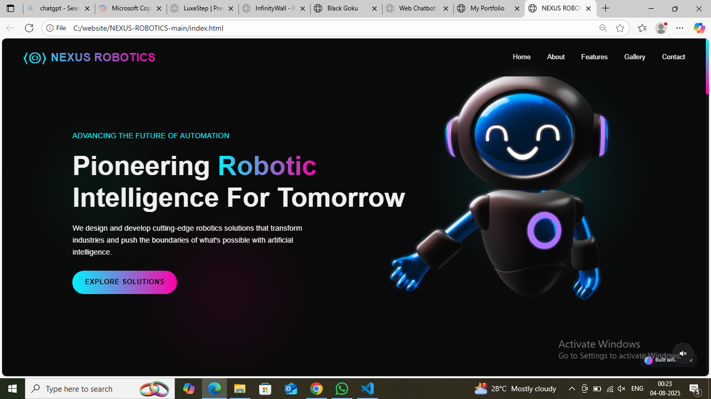

# NEXUS ROBOTICS

## Overview
NEXUS ROBOTICS is a modern, responsive website for a fictional robotics company that specializes in advanced AI and robotics solutions. The website showcases the company's products, services, and expertise in the field of robotics and artificial intelligence.

## Features
- **Responsive Design**: Fully responsive layout that works on mobile, tablet, and desktop devices
- **Modern UI**: Sleek, futuristic design with neon color accents and smooth animations
- **Interactive Elements**: Animated counters, parallax effects, and hover animations
- **3D Model Integration**: Interactive 3D robot model using Spline
- **Contact Form**: Functional contact and newsletter subscription forms
- **Sound Toggle**: Optional ambient sound effects for an immersive experience

## Technologies Used
- HTML5
- CSS3 (with custom properties, flexbox, and grid)
- JavaScript (vanilla JS for animations and interactivity)
- Font Awesome for icons
- Spline for 3D model visualization

## Pages/Sections
- Home/Hero Section
- About Section
- Features Section
- Gallery Section
- Contact Section
- Footer with additional links and newsletter signup

## How to Use
1. Clone this repository
2. Open `index.html` in your web browser
3. Navigate through the website using the navigation menu

## Preview

## Future Improvements
- Add more interactive 3D models
- Implement a dark/light theme toggle
- Create individual product pages
- Add a blog section for robotics news and updates
- Implement a working backend for the contact form

## License
This project is available for personal and commercial use.
